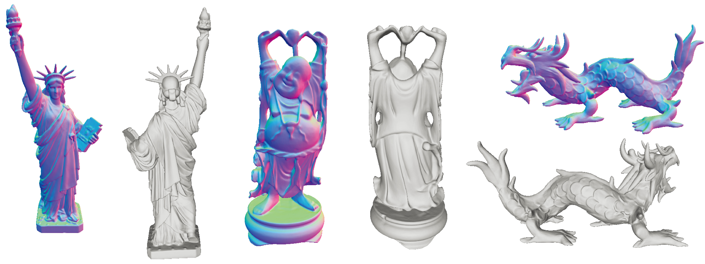
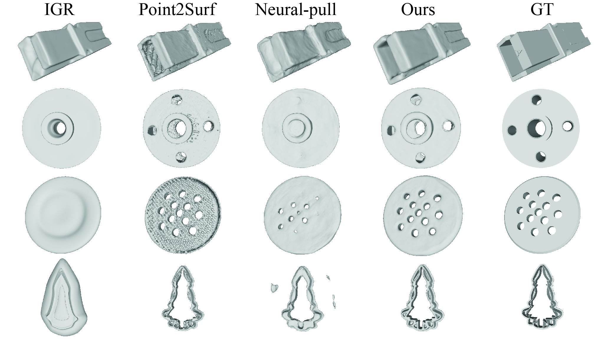
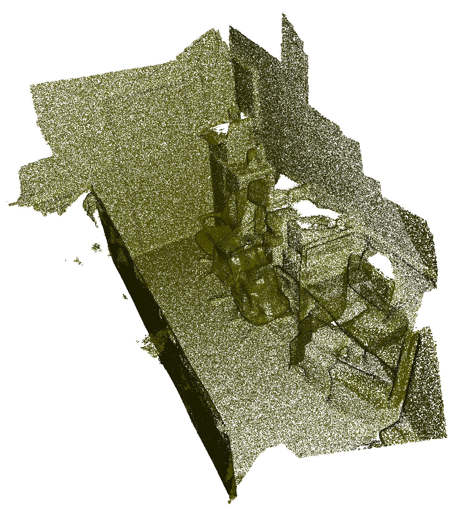
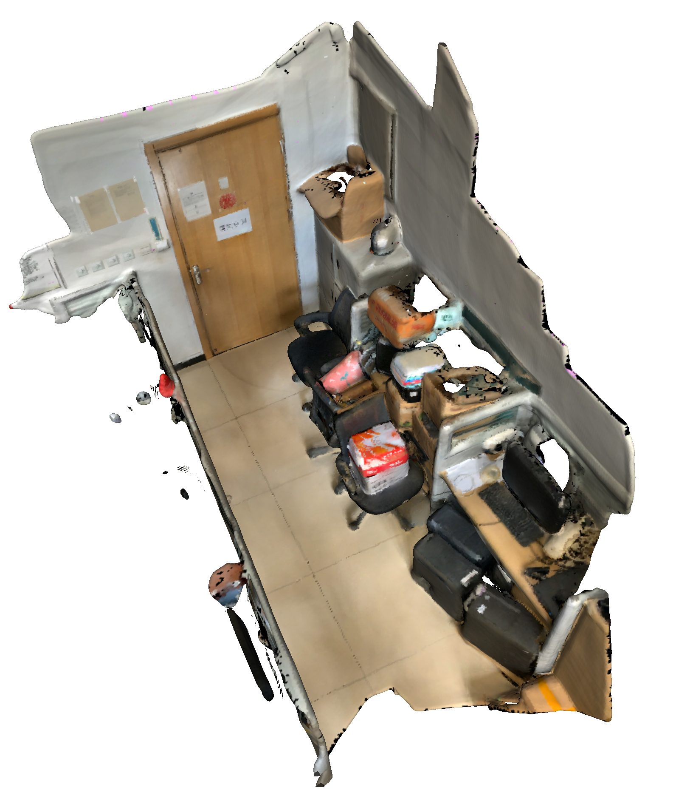
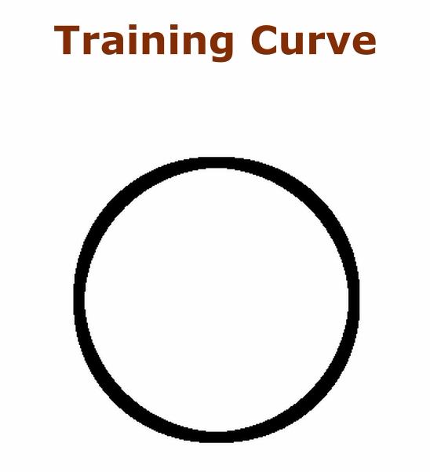
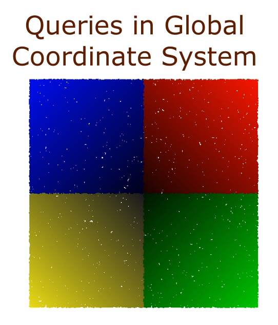

# Surface Reconstruction from Point Clouds by Learning Predictive Context Priors (CVPR 2022)
<h2 align="center"><a href="https://arxiv.org/abs/2204.11015">Paper</a> | <a href="https://mabaorui.github.io/PredictableContextPrior_page/">Project Page</a></h2>
This repository contains the code to reproduce the results from the paper.
[Surface Reconstruction from Point Clouds by Learning Predictive Context Priors](https://arxiv.org/abs/2204.11015).

You can find detailed usage instructions for training your own models and using pretrained models below.

If you find our code or paper useful, please consider citing

    @inproceedings{PredictiveContextPriors,
        title = {Surface Reconstruction from Point Clouds by Learning Predictive Context Priors},
        author = {Baorui, Ma and Yu-Shen, Liu and Matthias, Zwicker and Zhizhong, Han},
        booktitle = {Proceedings of the IEEE/CVF Conference on Computer Vision and Pattern Recognition (CVPR)},
        year = {2022}
    }

## Surface Reconstruction Demo
<p align="left">
  
</p>

<p align="left">
  
</p>

<p align="left">
  
</p>


## Predicted Queries Visualization
<p align="left">
  
</p>

### Predicted queries in Loccal Coorinate System
<p align="left">
  
</p>

## Installation
First you have to make sure that you have all dependencies in place.
The simplest way to do so, is to use [anaconda](https://www.anaconda.com/). 

You can create an anaconda environment called `tf` using
```
conda env create -f tf.yaml
conda activate tf
```
## Training
You should train the Local Context Prior Network first, run
```
python pcp.py --input_ply_file test.ply --data_dir ./data/ --CUDA 0 --OUTPUT_DIR_LOCAL ./local_net/ --OUTPUT_DIR_GLOBAL ./glocal_net/ --train --save_idx -1
```
You should put the point cloud file(--input_ply_file, only ply format) into the '--data_dir' folder.

Then train the Predictive Context Prior Network, run
```
python pcp.py --input_ply_file test.ply --data_dir ./data/ --CUDA 0 --OUTPUT_DIR_LOCAL ./local_net/ --OUTPUT_DIR_GLOBAL ./glocal_net/ --finetune --save_idx -1
```

## Test
You can extract the mesh model from the trained network, run
```
python pcp.py --input_ply_file test.ply --data_dir ./data/ --CUDA 0 --OUTPUT_DIR_LOCAL ./local_net/ --OUTPUT_DIR_GLOBAL ./glocal_net/ --test --save_idx -1
```
